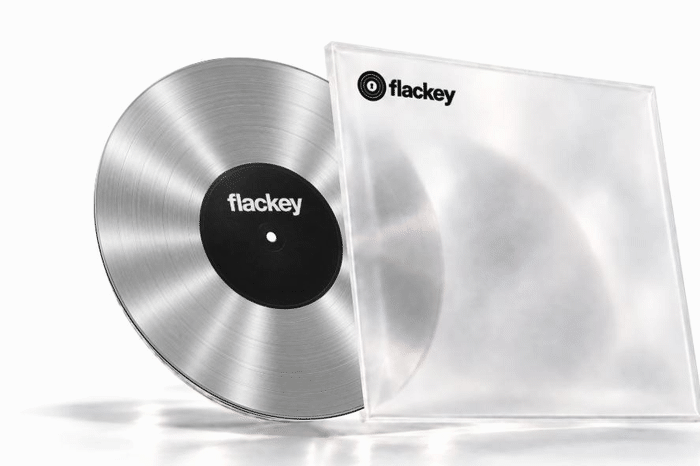
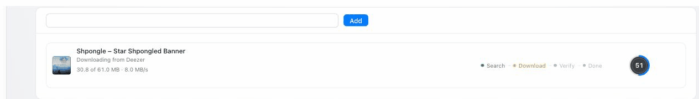
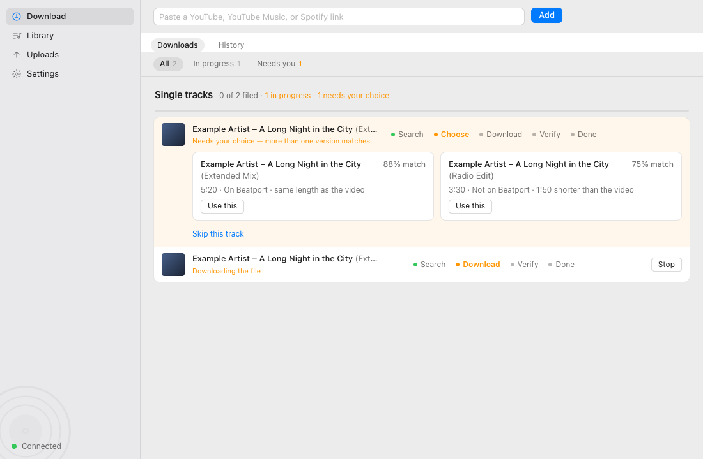
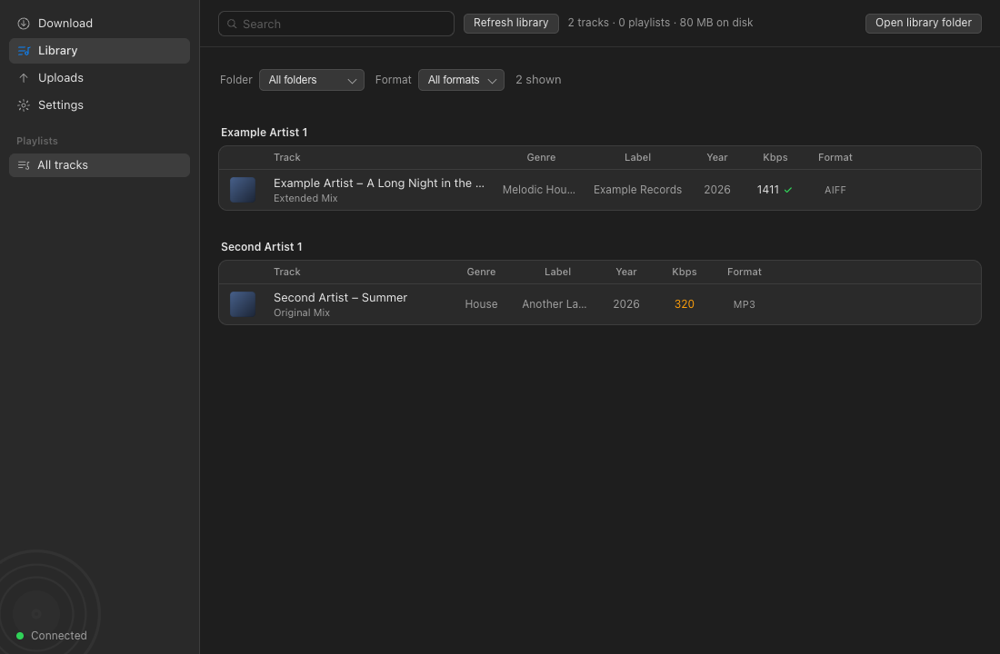
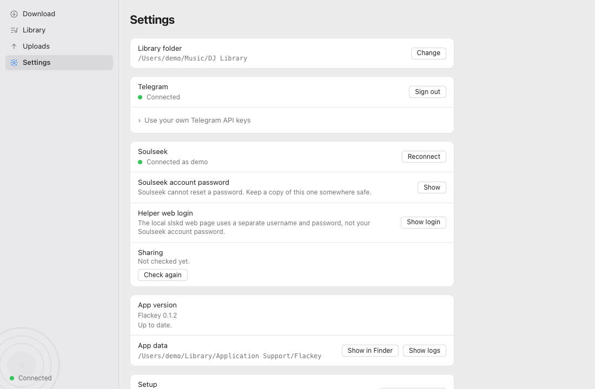
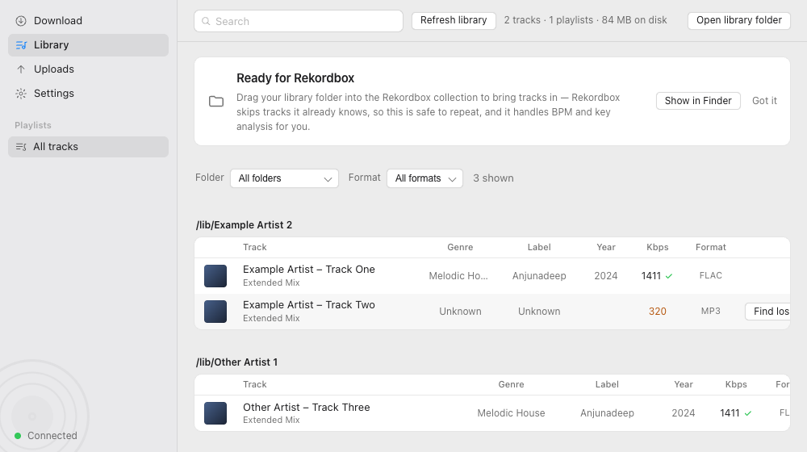

# 🎧 Flackey

**Paste a link. Get the FLAC.** Flackey is a dark, pro-audio-style desktop app
for Mac that turns a YouTube or YouTube Music link into a tagged, Rekordbox-ready
track in your DJ library — automatically.

Paste the link into the app; a worker running on the Mac finds the track
through a Telegram source bot (using your own Telegram account), matches it
on Beatport, verifies it is genuine 320 kbps or better (lossless where
Soulseek has it), tags it and files it under `~/Music/DJ Library/<Artist>/`,
and writes M3U8 playlists for Rekordbox import. BPM and key are left to
Rekordbox's analysis; genre and label are in the tags.

<p align="center">
  <a href="https://github.com/EyalDelarea/flackey/actions/workflows/checks.yml"></a>
  <a href="https://github.com/EyalDelarea/flackey/actions/workflows/codeql.yml"></a>
  <a href="https://github.com/EyalDelarea/flackey/releases"></a>
  <a href="https://github.com/EyalDelarea/flackey/releases"></a>
  <a href="LICENSE"></a>
  
</p>

<p align="center">
  
</p>

## ⬇️ Download

Built for Apple Silicon Macs: **[eyaldelarea.github.io/flackey](https://eyaldelarea.github.io/flackey/)** — one zip,
one Terminal command to clear the download flag, and the setup screen does the rest. Everything below is
for running from a checkout.

## ✨ See it in action

<p align="center">
  
  <br><sub>Paste a link — Flackey searches, downloads, and verifies it against the source.</sub>
</p>

<table>
<tr>
<td width="50%">

<br>Paste a link, pick the right match when there's more than one.
</td>
<td width="50%">

<br>Every track, tagged and filed — dark mode included.
</td>
</tr>
<tr>
<td width="50%">

<br>Telegram, Soulseek, and library folder, all in one place.
</td>
<td width="50%">

<br>The app tells you exactly how to get tracks into Rekordbox.
</td>
</tr>
</table>

## 🧰 Requirements

- macOS
- Homebrew `ffmpeg` and `yt-dlp`
- [uv](https://docs.astral.sh/uv/), Python 3.12

## ⚙️ Setup

```bash
cp .env.example .env   # optional: TELEGRAM_API_ID, TELEGRAM_API_HASH (the Telegram step asks for them otherwise)
uv sync
npm --prefix web install
npm --prefix web run build   # builds web/dist, which flackey start serves
```

## 🎚️ Usage

```bash
uv run flackey start          # worker + web UI, until Ctrl-C; opens the UI in a browser
uv run flackey start --no-browser
```

The first launch walks you through a short setup: pick the library folder,
then sign in to Telegram (scan a QR code with the Telegram app, or use a
phone number instead), then a Soulseek account. Either source can be
skipped and turned on later from Settings; with both off the app files
nothing. A packaged build carries Flackey's own Telegram API keys; from a
checkout, put yours in `.env` (`TELEGRAM_API_ID`, `TELEGRAM_API_HASH`) or
paste them into the Telegram step, which offers fields whenever this copy
has none.

Then paste a YouTube or YouTube Music track/playlist link into the UI.
Plain text is refused and queues nothing. Useful companions:

```bash
uv run flackey add "https://music.youtube.com/watch?v=…"   # enqueue from the Mac, no phone needed
uv run flackey status                                     # queue counts and library size
uv run flackey export                                     # rewrite every M3U8 playlist file
```

Flackey connects to Telegram directly through its saved Telethon session. Telegram Desktop does not need
to be open while Flackey searches or downloads; the Deezer bot source can be switched on or off in Settings.

## 💿 Rekordbox import

No `rekordbox.xml` is written, on purpose: Rekordbox's XML bridge is a
one-way import, and a generated XML carries none of the owner's hot cues,
memory cues, or ratings, so regenerating it after every track would make one
careless drag destructive. Instead:

1. Drag `~/Music/DJ Library` (or an artist folder) into the Rekordbox
   collection. Rekordbox skips tracks it already knows, so this is safe to
   repeat, and existing tracks' Rekordbox data is never touched. New tracks
   pick up their Beatport tags and artwork from the file itself.
2. File -> Import -> Playlist, choose `~/Music/DJ Library/Playlists/<name>.m3u8`.
   Re-importing the same file after new tracks are added is also safe: cues
   set on tracks already in the collection are preserved.

The important part is that Flackey writes files and playlists, not Rekordbox's
database. Rekordbox stays the source of truth for performance metadata.

<details>
<summary><strong>📡 Notes on Telegram behaviour</strong></summary>

- **Session expiry**: if the owner's Telethon session goes missing or
  expires, `flackey start` does not exit — the web UI keeps running so links
  still queue, but the worker pauses. `/api/health` reports
  `telegram_authorized: false`, and the UI shows an amber "Telegram signed
  out" banner with a Reconnect button. Reconnecting takes you through the
  same sign-in screen as first-time setup (QR code or phone number), without
  restarting `flackey start`; the worker resumes automatically once you're
  signed back in.

</details>

<details>
<summary><strong>🎼 Lossless via Soulseek</strong></summary>

Optional. With a running [slskd](https://github.com/slskd/slskd) sidecar, every request first asks the
Soulseek network for a FLAC of the matched track. The file is verified (spectral cutoff), proven to be the
same recording as the Deezer match with a Chromaprint fingerprint against Deezer's 30 s preview, converted to
AIFF (audio untouched, peer tags dropped) and tagged from Beatport. On any miss the Deezer MP3 is fetched as
before. The Done line says what you got: `AIFF 16-bit/44.1 kHz, from FLAC via Soulseek` or
`MP3 320 kbps via Deezer`.

1. `brew install chromaprint` (for `fpcalc`; without it the recording check is skipped and shown as such).
2. Download the slskd release for macOS, put it in `~/Library/Application Support/Flackey/slskd/` with a
   `slskd.yml` like:

   ```yaml
   web:
     port: 5030
     authentication:
       api_keys:
         flackey: { key: "<random 32+ chars>", role: readwrite }
   soulseek:
     username: <your soulseek account>
     password: <its password>
     listen_port: 50300
   shares:
     directories: ["~/Music/DJ Library"]
   directories:
     downloads: ~/Library/Application Support/Flackey/slskd/downloads
   ```

   Start it with `./slskd --app-dir "~/Library/Application Support/Flackey/slskd"`. Sharing your library is
   what makes peers serve you.
3. Put the same key in `.env` as `SLSKD_API_KEY=` (or in `settings.json` as `slskd_api_key`). Restart.

   The setup screen writes all of this for you, including `shares.directories`, which is the DJ Library:
   sharing is what keeps a Soulseek account in good standing. Flackey also asks your router to open TCP
   50300 (NAT-PMP, then UPnP) every time it starts, and checks from outside whether the port answers;
   Settings › Sharing shows the result and, when the port is closed, what to forward by hand. Behind a
   VPN the forward has to be made on the VPN's side.
4. `/api/health` shows `lossless.provider.status` (`ok`, `not_logged_in`, `unreachable`), whether `fpcalc` is
   present, the last 24 h of attempt outcomes and the size of the raw attempt folder.

Every attempt is recorded: `GET /api/lossless/attempts`, the attempt block on a request, and the raw slskd
responses under `<data dir>/lossless/attempts/<id>/` (pruned after `LOSSLESS_KEEP_RAW_DAYS`, default 30).
`flackey lossless replay <request id>` re-runs the pick under the current settings and shows what changed.
A transfer cancelled by a cap can still complete on slskd's side; such files stay in slskd's downloads folder
and can be deleted at any time.

</details>

<details>
<summary><strong>🗂️ Where data lives</strong></summary>

- `~/Library/Application Support/Flackey/` on macOS; `~/.config/flackey/` elsewhere. The project has
  been named cratedigger and krater before this, and before the Mac-native move its data lived under
  `~/.config`, so first launch walks every one of those folders newest-first and brings the first it
  finds across: copied, verified file by file, and only then is the old one removed, with
  `<oldname>.sqlite` (and its `-wal`/`-shm` sidecars) and `<oldname>.log` renamed by prefix on the way.
  If the copy is incomplete both folders are kept and the failure is logged, never a half-migrated
  library. Absolute paths stored in the database are rebased on open, which is separate on purpose:
  they outlive the folder they point at. Contains the sqlite database, `settings.json`
  (with the library folder and Telegram api id/hash), the Telethon session, tmp downloads, and spectrogram PNGs.
  `settings.json` is created from env vars and can be updated via the app; env vars always override it.
- `~/Music/DJ Library/` — one folder per artist, plus `Playlists/*.m3u8`.

</details>

<details>
<summary><strong>🐳 Docker</strong></summary>

```bash
docker build -t flackey .
docker run --env-file .env -v flackey-data:/data -v /path/to/library:/library -p 8765:8765 flackey
```

Open `http://localhost:8765` and sign in to Telegram from the setup screen
(QR code or phone number). The Telethon session is stored in the `/data`
volume, so this only needs to happen once. `uv run flackey login` also works
as a terminal-only alternative, run once beforehand:

```bash
docker run --env-file .env -it -v flackey-data:/data flackey uv run flackey login
```

</details>

<details>
<summary><strong>🛠️ Development</strong></summary>

```bash
npm --prefix web install
npm --prefix web run build    # needed once before flackey start
uv run pytest -q
uv run ruff check src tests
uv run lint-imports   # module layering; see [tool.importlinter] in pyproject.toml for the exact contract
```

`flackey start` serves `web/dist` when present; otherwise the UI stays up but shows a 404. During development, run `npm --prefix web run dev` to start Vite on `:5173` proxying to `:8765`.

</details>

## 🤝 Contributing

Issues and PRs are welcome — see [`CONTRIBUTING.md`](CONTRIBUTING.md) for
setup, checks, and how PRs get labeled and titled for the changelog. Found a
security issue? See [`SECURITY.md`](SECURITY.md) instead of opening a public
issue.

## 🙏 Acknowledgments

Flackey's lossless sourcing wouldn't exist without the [Soulseek](https://www.slsknet.org/)
network and everyone who keeps sharing their libraries on it, and without
[slskd](https://github.com/slskd/slskd), the open-source Soulseek client/daemon
that Flackey's lossless feature talks to. If Flackey finds you a peer's FLAC,
share your own library back — that reciprocity is what keeps Soulseek alive.

Also built on [yt-dlp](https://github.com/yt-dlp/yt-dlp), [ffmpeg](https://ffmpeg.org/),
and [Chromaprint](https://github.com/acoustid/chromaprint) for source fetching,
transcoding, and audio fingerprinting.

## 📚 More

- Release process (PR labels, version bump, tagging): `docs/RELEASING.md`
- Source bot protocol notes: `docs/source-bot-protocol.md`

## 📄 License

[MIT](LICENSE)
