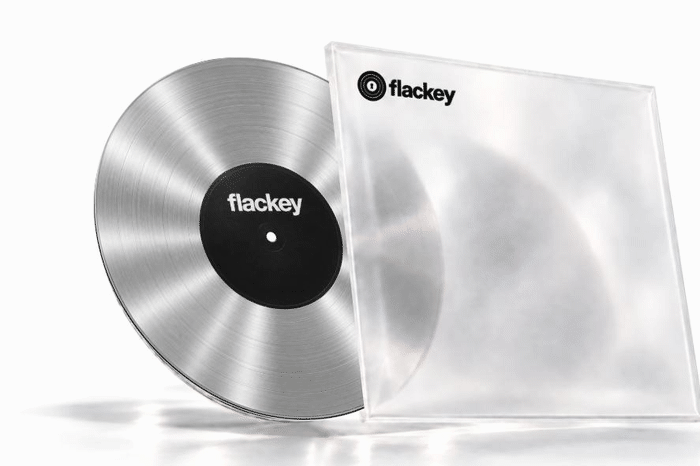
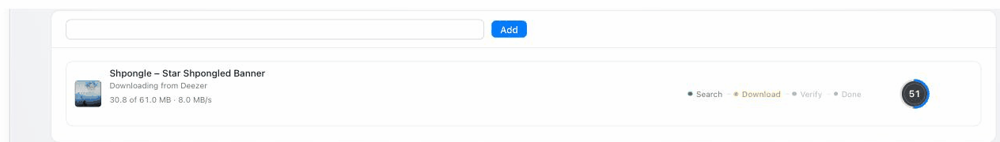
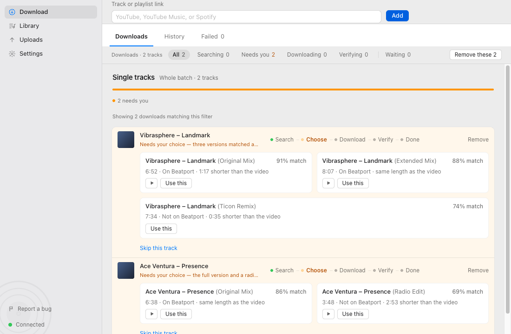
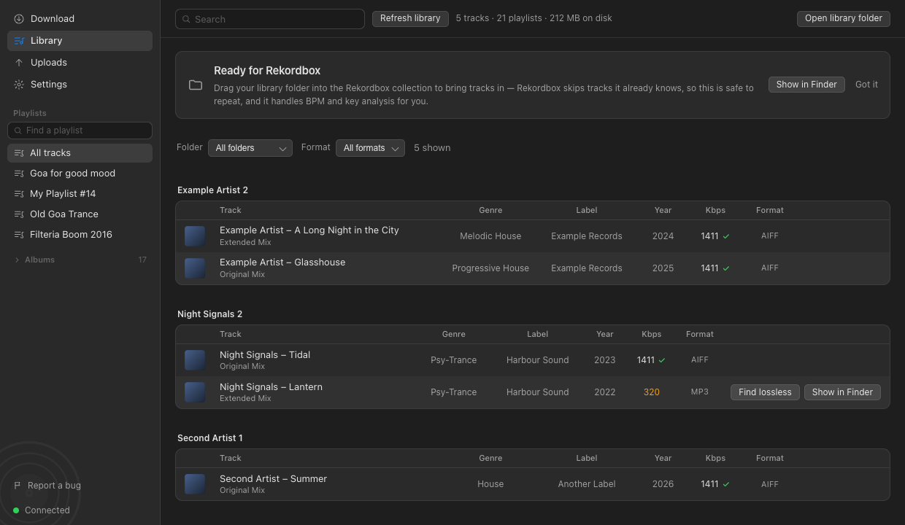
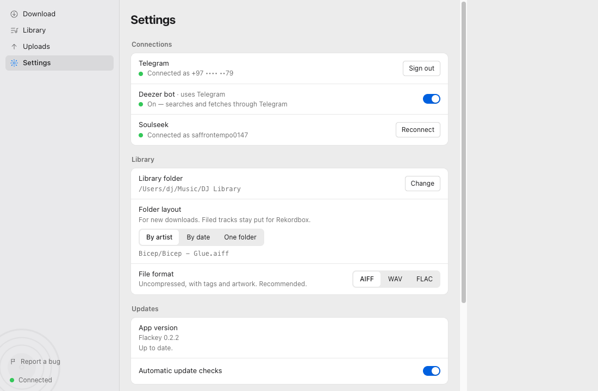
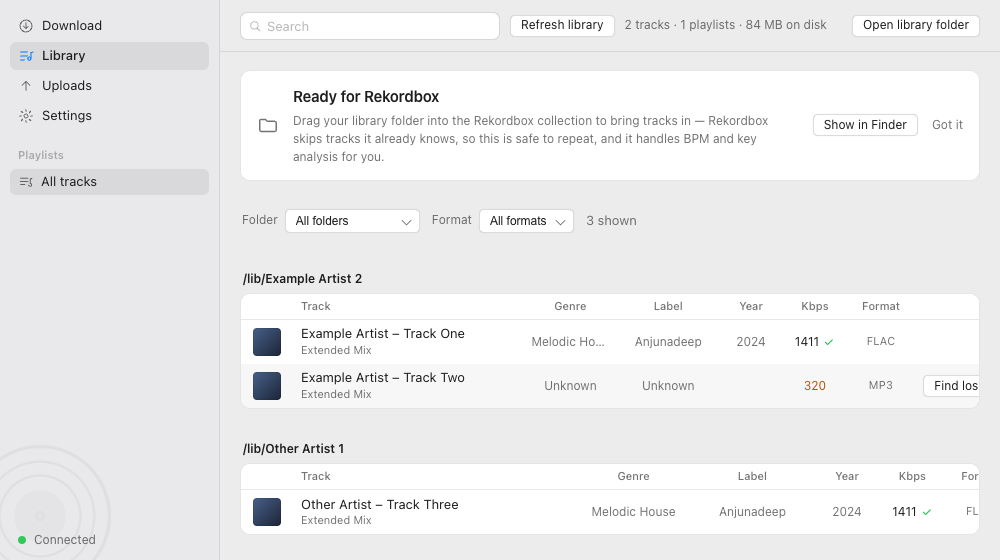

# 🎧 Flackey

**Paste a link. Get the FLAC.** Flackey is a dark, pro-audio-style desktop app
for Mac and Windows that turns a YouTube, YouTube Music or Spotify link into a
tagged, Rekordbox-ready track in your DJ library — automatically.

Paste the link into the app; a worker running on your computer matches the track
on Beatport, fetches it from Soulseek (lossless) or through a Telegram source bot
(using your own accounts), verifies it is genuine 320 kbps or better, tags it and
files it in your DJ Library (by default one folder per artist,
`~/Music/DJ Library/<Artist>/`), and writes M3U8 playlists for Rekordbox import.
BPM and key are left to Rekordbox's analysis; genre and label are in the tags.

<p align="center">
  <a href="https://github.com/EyalDelarea/flackey/actions/workflows/checks.yml"></a>
  <a href="https://github.com/EyalDelarea/flackey/actions/workflows/codeql.yml"></a>
  <a href="https://github.com/EyalDelarea/flackey/releases"></a>
  <a href="https://github.com/EyalDelarea/flackey/releases"></a>
  <a href="LICENSE"></a>
  
</p>

<p align="center">
  
</p>

## ⬇️ Download

Get the latest version from **[eyaldelarea.github.io/flackey](https://eyaldelarea.github.io/flackey/)** or the
[releases page](https://github.com/EyalDelarea/flackey/releases). The setup screen does the rest.

- **Mac** (Apple Silicon, macOS 12 or newer): open `Flackey.pkg`. The installer isn't signed with an Apple
  Developer ID, so macOS may block it the first time. Open **System Settings › Privacy & Security** and
  click **Open Anyway**, or on macOS 14 and earlier control-click `Flackey.pkg` and choose **Open**.
  Step-by-step: [`packaging/README-for-friends.md`](packaging/README-for-friends.md).
- **Windows** (64-bit Windows 10 or 11): run `Flackey-Setup.exe`. SmartScreen will probably say "Windows
  protected your PC"; click **More info**, then **Run anyway**. Step-by-step:
  [`packaging/README-windows.md`](packaging/README-windows.md).

Once installed, Flackey updates itself from inside the app. Everything from
[Run from a checkout](#-run-from-a-checkout) on is for developers.

## ✨ See it in action

<p align="center">
  
  <br><sub>Paste a link — Flackey searches, downloads, and verifies it against the source.</sub>
</p>

<table>
<tr>
<td width="50%">

<br>Paste a link, pick the right version when more than one matches.
</td>
<td width="50%">

<br>Every track, tagged and filed, with your playlists alongside — dark mode included.
</td>
</tr>
<tr>
<td width="50%">

<br>Connections, library folder, folder layout and file format, all in one place.
</td>
<td width="50%">

<br>The app tells you exactly how to get tracks into Rekordbox.
</td>
</tr>
</table>

## 🎛️ Features

- **Your folder layout.** Settings › Library › Folder layout files new tracks by artist (the default),
  by date (a folder per month or per day) or all in one folder. Changing it never moves tracks already
  filed, so Rekordbox doesn't lose them.
- **Your file format.** Lossless copies are filed as AIFF, WAV or FLAC (AIFF by default on a Mac, FLAC on
  Windows).
- **Playlists sidebar.** The Library page lists every playlist next to your tracks, groups album
  playlists together, scrolls on its own, and has a search box to find one.
- **Signed self-update.** Flackey checks for a new version (you can turn the check off) and installs it
  from inside the app. Every update is checked against an Ed25519 signature before it is installed.
- **In-app bug reports.** Help › Report a bug (also in the sidebar) opens an email to the developer with
  your description, plus a zip of the log and system details with personal information redacted.

## 🧰 Run from a checkout

You need:

- [uv](https://docs.astral.sh/uv/) (it installs Python 3.12 and yt-dlp for you)
- Node.js 22 and npm, to build the web UI
- `ffmpeg` (with `ffprobe`) and Chromaprint's `fpcalc` on your PATH. On a Mac:
  `brew install ffmpeg chromaprint`.

macOS is the main development platform. Windows checkouts work too (CI runs the test suite on Windows);
put `ffmpeg.exe`, `ffprobe.exe` and `fpcalc.exe` on your PATH.

### ⚙️ Setup

```bash
cp .env.example .env   # optional: TELEGRAM_API_ID, TELEGRAM_API_HASH (the Telegram step asks for them otherwise)
uv sync
npm --prefix web install
npm --prefix web run build   # builds web/dist, which flackey start serves
```

### 🎚️ Usage

```bash
uv run flackey start          # worker + web UI in the Flackey window, until Ctrl-C
uv run flackey start --browser    # the same, in your browser instead
uv run flackey start --no-browser # serve only; open the printed link yourself
```

The API only answers requests that carry a key made fresh at each launch. The app window gets it
automatically; in browser mode, `flackey start` prints a link with the key in it
(`http://127.0.0.1:8765/#t=...`). Open that link, not the bare address.

The first launch walks you through a short setup: pick the library folder,
then sign in to Telegram (scan a QR code with the Telegram app, or use a
phone number instead), then a Soulseek account. Either source can be
skipped and turned on later from Settings; with both off the app files
nothing. A packaged build carries Flackey's own Telegram API keys; from a
checkout, put yours in `.env` (`TELEGRAM_API_ID`, `TELEGRAM_API_HASH`) or
paste them into the Telegram step, which offers fields whenever this copy
has none.

Then paste a YouTube, YouTube Music or Spotify track or playlist link into the UI.
Plain text is refused and queues nothing. Useful companions:

```bash
uv run flackey add "https://music.youtube.com/watch?v=…"   # enqueue from a terminal
uv run flackey status                                     # queue counts and library size
uv run flackey export                                     # rewrite every M3U8 playlist file
```

Flackey connects to Telegram directly through its saved Telethon session. Telegram Desktop does not need
to be open while Flackey searches or downloads; the Deezer bot source can be switched on or off in Settings.

## 💿 Rekordbox import

No `rekordbox.xml` is written, on purpose: Rekordbox's XML bridge is a
one-way import, and a generated XML carries none of the owner's hot cues,
memory cues, or ratings, so regenerating it after every track would make one
careless drag destructive. Instead:

1. Drag `~/Music/DJ Library` (or one of its folders) into the Rekordbox
   collection. Rekordbox skips tracks it already knows, so this is safe to
   repeat, and existing tracks' Rekordbox data is never touched. New tracks
   pick up their Beatport tags and artwork from the file itself.
2. File -> Import -> Playlist, choose `~/Music/DJ Library/Playlists/<name>.m3u8`.
   Re-importing the same file after new tracks are added is also safe: cues
   set on tracks already in the collection are preserved.

The folder layout setting only changes which folders new tracks land in;
Rekordbox finds tracks by their full path, so tracks already filed are never
moved. Dragging the whole library folder works with every layout.

The important part is that Flackey writes files and playlists, not Rekordbox's
database. Rekordbox stays the source of truth for performance metadata.

<details>
<summary><strong>📡 Notes on Telegram behaviour</strong></summary>

- **Session expiry**: if the owner's Telethon session goes missing or
  expires, `flackey start` does not exit — the web UI keeps running so links
  still queue, but the worker pauses. `/api/health` reports
  `telegram_authorized: false`, and the UI shows an amber "Telegram signed
  out" banner with a Reconnect button. Reconnecting takes you through the
  same sign-in screen as first-time setup (QR code or phone number), without
  restarting `flackey start`; the worker resumes automatically once you're
  signed back in.

</details>

<details>
<summary><strong>🎼 Lossless via Soulseek</strong></summary>

Optional. With a running [slskd](https://github.com/slskd/slskd) sidecar, every request first asks the
Soulseek network for a FLAC of the matched track. The file is verified (spectral cutoff), proven to be the
same recording as what you asked for with a Chromaprint fingerprint against the request's own audio (the
YouTube video, or the matched record's 30 s preview), converted to your filing format (AIFF, WAV or FLAC;
audio untouched, peer tags dropped) and tagged from Beatport. On a miss the Deezer MP3 is fetched instead — and checked against the same
reference, so a copy that is a different recording is rejected rather than filed. The Done line says what you
got: `AIFF 16-bit/44.1 kHz, from FLAC via Soulseek` or `MP3 320 kbps via Deezer`.

The setup screen does all of this for you: it downloads a pinned,
checksum-verified slskd into `<data dir>/slskd/`, writes its config and starts it. The manual steps below
are for running your own slskd from a checkout.

1. Install Chromaprint for `fpcalc` (`brew install chromaprint` on a Mac; the packaged app ships its own).
   Without it nothing can be checked, and a request says so instead of filing a copy nothing vouched for.
2. Download the slskd release for your platform, put it in `<data dir>/slskd/` (the data dir is
   listed under "Where data lives" below) with a `slskd.yml` like:

   ```yaml
   web:
     port: 5030
     authentication:
       api_keys:
         flackey: { key: "<random 32+ chars>", role: readwrite }
   soulseek:
     username: <your soulseek account>
     password: <its password>
     listen_port: 50300
   shares:
     directories: ["~/Music/DJ Library"]
   directories:
     downloads: <data dir>/slskd/downloads
   ```

   Start it with `./slskd --app-dir "<data dir>/slskd"`. Sharing your library is
   what makes peers serve you.
3. Put the same key in `.env` as `SLSKD_API_KEY=` (or in `settings.json` as `slskd_api_key`). Restart.

   The setup screen writes all of this for you, including `shares.directories`, which is the DJ Library:
   sharing is what keeps a Soulseek account in good standing. Flackey also asks your router to open TCP
   50300 (NAT-PMP, then UPnP) every time it starts, and checks from outside whether the port answers;
   Settings › Advanced › Sharing shows the result and, when the port is closed, what to forward by hand. Behind a
   VPN the forward has to be made on the VPN's side.
4. `/api/health` shows `lossless.provider.status` (`ok`, `not_logged_in`, `unreachable`), whether `fpcalc` is
   present, the last 24 h of attempt outcomes and the size of the raw attempt folder.

Every attempt is recorded: `GET /api/lossless/attempts`, the attempt block on a request, and the raw slskd
responses under `<data dir>/lossless/attempts/<id>/` (pruned after `LOSSLESS_KEEP_RAW_DAYS`, default 30).
`flackey lossless replay <request id>` re-runs the pick under the current settings and shows what changed.
A transfer cancelled by a cap can still complete on slskd's side; such files stay in slskd's downloads folder
and can be deleted at any time.

</details>

<details>
<summary><strong>🗂️ Where data lives</strong></summary>

- The data dir: `~/Library/Application Support/Flackey/` on macOS, `%APPDATA%\Flackey` on Windows
  (uninstalling or upgrading leaves it alone), `~/.config/flackey/` elsewhere (Docker uses `/data`). Contains the sqlite
  database, `settings.json` (with the library folder and Telegram api id/hash), the Telethon session, tmp
  downloads, spectrogram PNGs, slskd, and the log (`flackey.log`). `settings.json` is created from env vars and can be updated via the
  app; env vars always override it.
- The DJ Library (`~/Music/DJ Library/` by default; `Music\DJ Library` in your user folder on Windows) —
  one folder per artist by default (or per month, per day, or none, from the folder layout setting), plus
  `Playlists/*.m3u8`.

</details>

<details>
<summary><strong>🐳 Docker</strong></summary>

```bash
docker build -t flackey .
docker run --env-file .env -v flackey-data:/data -v /path/to/library:/library -p 127.0.0.1:8765:8765 flackey
```

Every API request must carry an access key. The container prints a link with it on start
(`docker logs <container>` shows it again): open `http://localhost:8765/#t=<key>`, not the bare address.
The key changes on every restart unless you fix one in `.env`:

```bash
FLACKEY_API_TOKEN=<at least 32 characters; python3 -c 'import secrets; print(secrets.token_urlsafe(32))'>
```

Treat that key like a password. Still publish the port on `127.0.0.1` as above unless you mean to reach
Flackey from other machines: the key travels over plain HTTP, so anyone who can watch your network can
read it. To use it from another machine (`-p 8765:8765`), open it by the host's IP address, or list the
host names you use in `WEB_ALLOWED_HOSTS` (comma-separated, e.g. `WEB_ALLOWED_HOSTS=nas.local`); any
other name is refused.

Open the printed link and sign in to Telegram from the setup screen
(QR code or phone number). The Telethon session is stored in the `/data`
volume, so this only needs to happen once. `uv run flackey login` also works
as a terminal-only alternative, run once beforehand:

```bash
docker run --env-file .env -it -v flackey-data:/data flackey uv run flackey login
```

</details>

<details>
<summary><strong>🛠️ Development</strong></summary>

```bash
npm --prefix web install
npm --prefix web run build    # needed once before flackey start
uv run pytest -q
uv run ruff check src tests
uv run lint-imports   # module layering; see [tool.importlinter] in pyproject.toml for the exact contract
```

`flackey start` serves `web/dist` when present; otherwise the UI stays up but shows a 404. During development, run `npm --prefix web run dev` to start Vite on `:5173` proxying to `:8765`, and open `http://localhost:5173/#t=<key>` with the key `flackey start` printed.

</details>

## 🤝 Contributing

Issues and PRs are welcome — see [`CONTRIBUTING.md`](CONTRIBUTING.md) for
setup, checks, and how PRs get labeled and titled for the changelog. Found a
security issue? See [`SECURITY.md`](SECURITY.md) instead of opening a public
issue.

## 🙏 Acknowledgments

Flackey's lossless sourcing wouldn't exist without the [Soulseek](https://www.slsknet.org/)
network and everyone who keeps sharing their libraries on it, and without
[slskd](https://github.com/slskd/slskd), the open-source Soulseek client/daemon
that Flackey's lossless feature talks to. If Flackey finds you a peer's FLAC,
share your own library back — that reciprocity is what keeps Soulseek alive.

Also built on [yt-dlp](https://github.com/yt-dlp/yt-dlp), [ffmpeg](https://ffmpeg.org/),
and [Chromaprint](https://github.com/acoustid/chromaprint) for source fetching,
transcoding, and audio fingerprinting.

## 📚 More

- Download page: [eyaldelarea.github.io/flackey](https://eyaldelarea.github.io/flackey/)
- Installing on a Mac: [`packaging/README-for-friends.md`](packaging/README-for-friends.md)
- Installing on Windows: [`packaging/README-windows.md`](packaging/README-windows.md)
- Release process (PR labels, version bump, tagging): [`docs/RELEASING.md`](docs/RELEASING.md)
- Source bot protocol notes: [`docs/source-bot-protocol.md`](docs/source-bot-protocol.md)

## 📄 License

[MIT](LICENSE)
